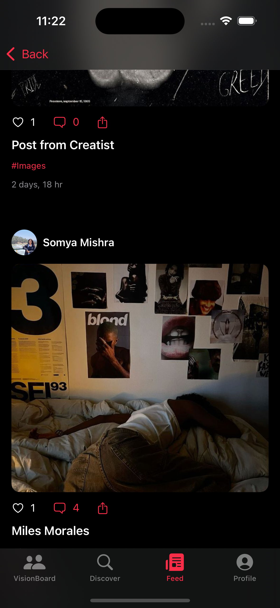
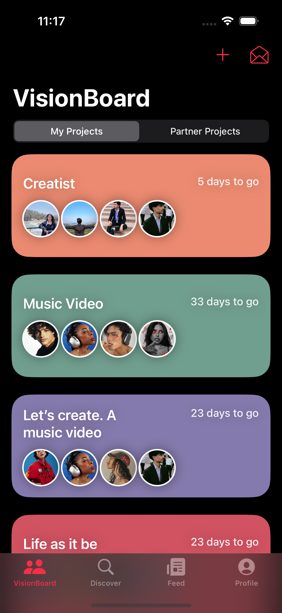
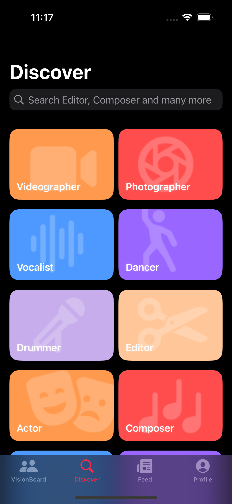

# Creatist

Creatist is a collaborative platform for creators—artists, musicians, filmmakers, designers, and more—to connect, share, and bring their visions to life. Built with SwiftUI, Creatist offers a seamless experience for discovering talent, managing projects, and fostering creative collaboration.

---

## Table of Contents
- [Features](#features)
- [Screenshots](#screenshots)
- [App Structure](#app-structure)
- [Core Modules](#core-modules)
- [Data Model](#data-model)
- [Setup & Installation](#setup--installation)
- [Usage](#usage)
- [Privacy & Terms](#privacy--terms)
- [Contributing](#contributing)
- [Support](#support)
- [Credits](#credits)

---

## Features
- **Vision Boards:** Create, manage, and collaborate on creative projects with vision boards, tasks, and assignments.
- **Discover Creators:** Find and connect with creators by genre, skill, or location.
- **Feed:** View trending and followed posts, interact with content, and explore top works.
- **Profile Management:** Edit your profile, update your location, and showcase your work.
- **Chat & Messaging:** Real-time chat for collaboration and networking.
- **Authentication:** Secure login, signup, and OTP-based flows.
- **Media Uploads:** Share images and videos in posts and projects.
- **Privacy & Security:** Built-in privacy policy, terms of service, and secure data handling.

---

## Screenshots

<div align="center">
  
  
  
</div>

*From left to right: Feed with trending posts, Vision Board project management, and Discover creators by genre*

---

## App Structure
- **Splash Screen:** Animated splash, then auto-login or login/signup flow.
- **Main Tabs:**
  - **VisionBoard:** Project management and collaboration.
  - **Discover:** Browse creators by genre and location.
  - **Feed:** Trending and following content.
  - **Profile:** User profile, settings, and legal info.

---

## Core Modules
- **VisionBoard/**
  - Project/vision board management, assignments, notifications, and invitations.
- **Discover/**
  - User discovery by genre, location, and search.
- **FeedTabView.swift**
  - Trending and following feeds, post details.
- **ProfileView.swift**
  - User profile, stats, settings, privacy, and terms.
- **Chat/**
  - Real-time chat, WebSocket management, and message history.
- **Auth/**
  - Login, signup, OTP, and authentication flows.
- **DataController/**
  - `Creatist.swift`: App singleton for user/session management and backend integration.
  - `NetworkManager.swift`: API networking and token management.
  - `KeychainHelper.swift`: Secure credential storage.
- **DataModel/**
  - All app data models (User, Post, VisionBoard, etc.).

---

## Data Model
- **User:** Profile, genres, location, rating, and social stats.
- **Post:** Media, tags, captions, and engagement.
- **VisionBoard:** Collaborative project boards, assignments, and status.
- **Task/Assignment:** Project tasks, priorities, and dependencies.
- **ChatMessage:** Real-time messaging structure.

See `Creatist/DataModel/DataModels.swift` for full details.

---

## Setup & Installation
1. **Clone the repository:**
   ```sh
   git clone <your-repo-url>
   cd CreatistSwiftUI/Creatist
   ```
2. **Open in Xcode:**
   - Open `Creatist.xcodeproj` in Xcode 14 or later.
3. **Configure Backend:**
   - Update API endpoints in `DataController/NetworkManager.swift` as needed.
   - Ensure your backend (e.g., Supabase, custom API) is running and accessible.
4. **Assets:**
   - All genre and app icons are in `Assets.xcassets`.
5. **Run the App:**
   - Select a simulator or device and press **Run** (⌘R).

---

## Usage
- **Sign Up / Login:** Create an account or log in with your credentials.
- **Profile:** Edit your profile, update your location, and manage your works.
- **Vision Boards:** Start a new project, invite collaborators, assign tasks, and track progress.
- **Discover:** Search and connect with creators by genre or location.
- **Feed:** Browse trending and followed posts, view details, and interact.
- **Chat:** Start conversations with collaborators or new connections.
- **Settings:** Access privacy policy, terms of service, and support.

---

## Privacy & Terms
- The app includes in-app **Privacy Policy** and **Terms of Service** (see Profile > Settings).
- Data is handled securely and in compliance with Indian law (IT Act, DPDP Act 2023).
- See `ProfileView.swift` for the full legal text.

---

## Contributing
1. Fork the repository and create your branch:
   ```sh
   git checkout -b feature/your-feature
   ```
2. Make your changes and commit:
   ```sh
   git commit -am 'Add new feature'
   ```
3. Push to your fork and open a Pull Request.

**Code Style:**
- Use Swift best practices and follow the existing code style.
- Write clear, concise commit messages.
- Add documentation/comments for complex logic.

---

## Support
- For issues, bug reports, or feature requests, open an issue on GitHub.
- For legal or privacy concerns, see the in-app Privacy Policy or contact the Grievance Officer (details in Profile > Settings).

---

## Credits
- Developed by Creatist Team.
- Special thanks to all open-source contributors and the creative community.

--- 
